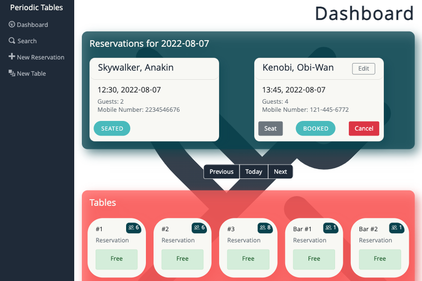
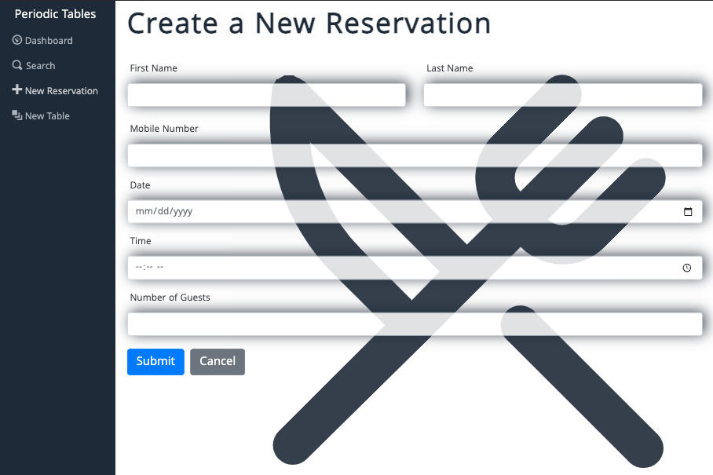
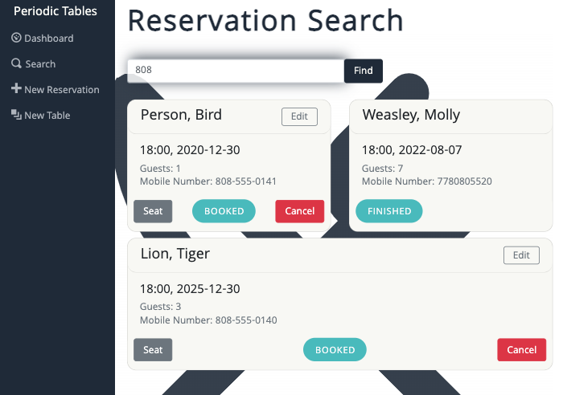
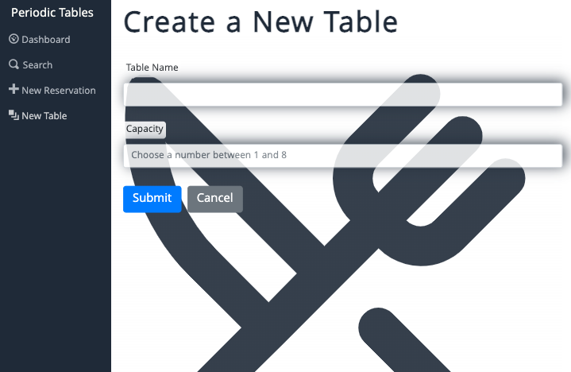
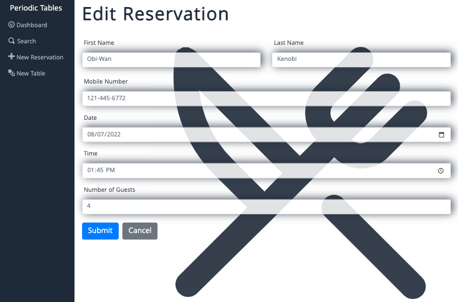
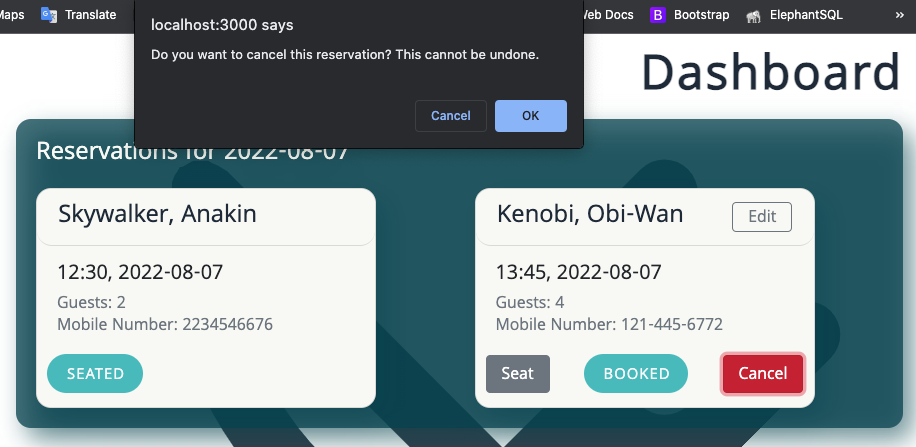
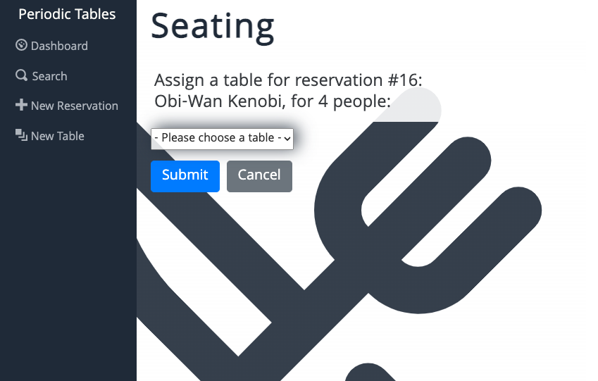
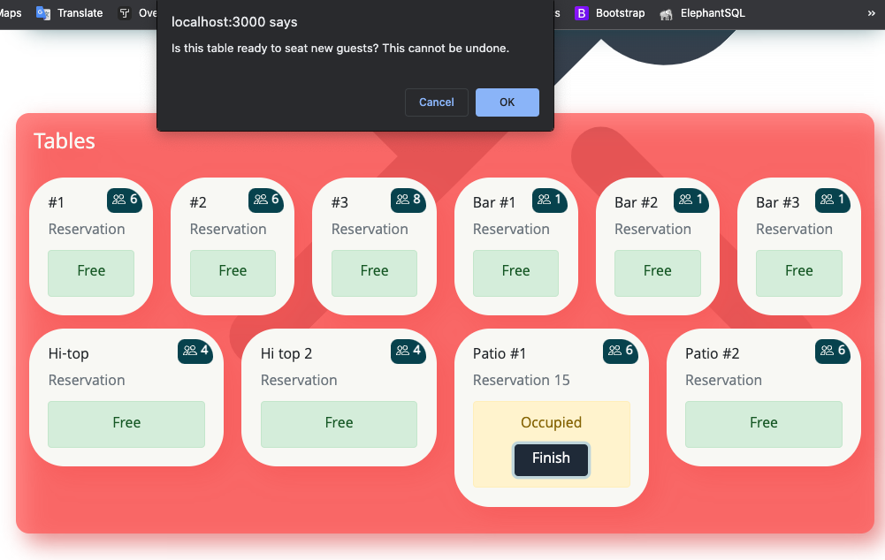

# Periodic Tables - Restaurant Reservation System
"Periodic Tables" is my final capstone project in [Thinkful's](https://www.thinkful.com/bootcamp/web-development/) online Software Engineering program. 
It is a full-stack web application intended to assist restaurant management in booking, seating, editing, and searching for reservations.
This final project was an opportunity for me to combine all the skills I've learned throughout my studies to create a fully functioning and aesthetically pleasing
program using clean, effective, DRY code.

I implemented 8 user features using both inside-out and outside-in TDD, depending on the user story's function. 
Each user story was created as an individual branch before merging. You can view the instructions for each feature [here](capstone_instructions.md).
All user stories involved front and back-end testing, appropriate error-handling, and routes and middleware. I created and ran migrations using Knex to set up
a database and seeded it accordingly. ```cors``` is implemented in the backend.

### Check it out!
I deployed both the server and client of this monorepo on Render - you can view and test it out [here!](https://periodic-tables-frontend-sve1.onrender.com)

## Languages & Frameworks used:
- [React](https://github.com/facebook/create-react-app) & React Router
- JavaScript
- CSS
- [Bootstrap CSS](https://github.com/twbs/bootstrap)
- Node.js
- Express.js
- Knex.js
- PostgreSQL with Elephant SQL

## Features
### Dashboard (Home Page)
The Dashboard is the home page of the application, displaying side-bar navigation links, the current day's reservations, a button toolbar, and tables.
If there are no reservations on the current day, a message displays "No reservations on this date."
#### Reservations
Each reservation card displays a customer's reservation information. If a reservation is finished for that day, it is not shown on the dashboard.
The footer of each card contains a button leading to the "Seat" page (```/reservations/:reservation_id/seat```), a reservation status badge, and a "Cancel" button.
#### Tables
Each table card displays the table name, a capacity badge, and status. Default status is green for "free," and displays in yellow when "occupied."




### Create a Reservation
The "New Reservation" page (```/reservations/new```) allows the user to create a new reservation. Input fields include first/last name, mobile number, date, time, and number of guests. Each field has validations in the form component as well as in the back-end, and will display an error message in red at the top of the page for any violations. Clicking "Cancel" returns to the previous page, while clicking "Submit" sends a POST request to the server, creates the reservation, and displays it on the dashboard on it's given reservation day.




### Search
The "Search" page allows the user to search for an existing reservation by mobile number. Search input can be any combination or length of numbers.
Clicking "Find" sends a GET request to the server, and displays all existing reservations with a mobile number that includes the given combination of numbers. "No reservations found" is displayed otherwise.




### Create a New Table
The "New Table" page (```/tables/new```) allows the user to create a new table for the restaurant. Input fields include the table name (such as "Hi-top #4" or "Patio #2") and the table capacity, which must be a number between 1 and 8. Appropriate validation is included in the front and back-end as well as error messages.
Clicking "Cancel" returns to the previous page, while "Submit" sends a POST request to the server, creates the table, and adds it to the tables list on the Dashboard.




### Edit a Reservation
The "Edit Reservation" page (```/reservations/:reservation_id/edit```) allows the user to edit an existing reservation. Clicking the "Edit" button on a reservation card redirects to this page and displays the same form component used for "Create a New Reservation," prefilled with the given reservation's existing information. The same validations are used here as well. Clicking "Submit" sends a PUT request to the server, updates the reservation information, and displays the Dashboard.




### Cancel a Reservation
On each reservation card, a "Cancel" button is displayed only when the reservation status is "booked." Clicking "Cancel" presents a message asking the user to confirm whether or not they wish to cancel the reservation. Clicking "Ok" sends a PUT request to the server, changes the reservation status to "Cancelled," and removes the "Edit" and "Seat" buttons from the reservation card.




### Assign a Table
Each reservation card contains a "Seat" button that leads to the "Seating" page (```/reservations/reservation_id/seat```). The user can choose a table from the dropdown menu, which contains all table names as well as their capacity. Clicking "Cancel" returns to the previous page, while clicking "Submit" sends a PUT request to the server to add the given reservation_id to the chosen table, and then displays the dashboard. The reservation card then displays a status of "Seated" and the assigned table displays a status of "Occupied" with a "Finish" button.




### Finish a Table
An occupied table displays a "Finish" button. Clicking "Finish" displays a message to the user to confirm whether or not the reservation is finished and the table can become unoccupied. Clicking "Ok" sends a DELETE request to the server, removing the current reservation_id from the table to change the table's status to "free." The given reservation's status is changed to "finished." A reservation with a status of "finished" is not displayed on the dashboard.




## Testing
I used development, testing, preview, and production environments for this application, each with their own database instance. Responsiveness was tested with DevTools and on various devices including phones and tablets.

I used [Postman](https://www.postman.com/) to test all of my back-end routes and HTTP requests, including error messages and validation. I also used the [WAVE](https://wave.webaim.org/) accessibility evaluation tool, as well as [regex101](regex101.com) for regular expression testing and [BrowserStack](browserstack.com) for cross-browser testing.
